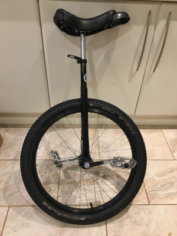

On 12th May 2017 I will be 40 years old. To help me get over this terrible event I'm going to undertake 6 crowd-sourced challenges in the
preceding months.

But first a history lesson...

# Turning 30

Back in 2006 and 2007, to make turning 30 more bearable (seems trivial when you're about to hit 40) I asked people to suggest
6 challenges for me to undertake in the 6 months preceding the birthday.

People suggested all kinds of activities ranging from bog snorkelling to donating bone marrow.
In the end I picked these challenges:

1. [Run around a castle in your underwear](http://richoramablog.blogspot.co.uk/2006/11/things-to-de-before-youre-30-task-1.html)
1. [Make a short film](http://richoramablog.blogspot.co.uk/2006/12/things-to-do-before-youre-30-task-2.html)
1. [Go down the deepest cave, and up the highest mountain in England](http://richoramablog.blogspot.co.uk/2007/01/things-to-do-before-youre-30-task-3.html)
1. [Go to a party with an outfit costing less than £5](http://richoramablog.blogspot.co.uk/2007/02/things-to-do-before-youre-30-task-4_25.html)
1. [Run between Kenilworth and Warwick Castles](http://richoramablog.blogspot.co.uk/2007/05/castle-run-video.html)
1. [Scale the Sydney Harbour Bridge](http://richoramablog.blogspot.co.uk/2007/04/things-to-do-before-youre-30-task-6.html)

# Turning 40

Now I'm turning 40 I'm going to do another 6 challenges.

## 1. Christmas Day Swim in the Sea - ✓ DONE

Thank you Carla Wiggins for suggesting this one! Due to ill health this was delayed to New Year's Eve.
However, full submersion in the North Sea at Felixstowe was undertaken, albeit for a rather brief period.

After a quick change in the family beach hut I sauntered down to the sea and jumped in.
It was quite cold, my skin was numb to the touch afterwards.

## 2. Learn to Ride a Unicycle and Enter a Race - IN PROGRESS

Thank you Geoffrey Huntley for this suggestion!

Unicycling is something I've always wanted to try, so I was delighted to receive one from Father Christmas.

I'm currently learning to ride it, slowly.

## 3. 48 Hour Famine - NOT STARTED

Thank you Elliot Astbury for this suggestion!

I'm going to start this when there's nothing nice for dinner.

## More Suggestions Needed

I'd like you to come up with some more ideas.

The easiest way to contribute an idea is to [add an issue](https://github.com/richorama/40/issues) in the GitHub repo or add a comment below.
